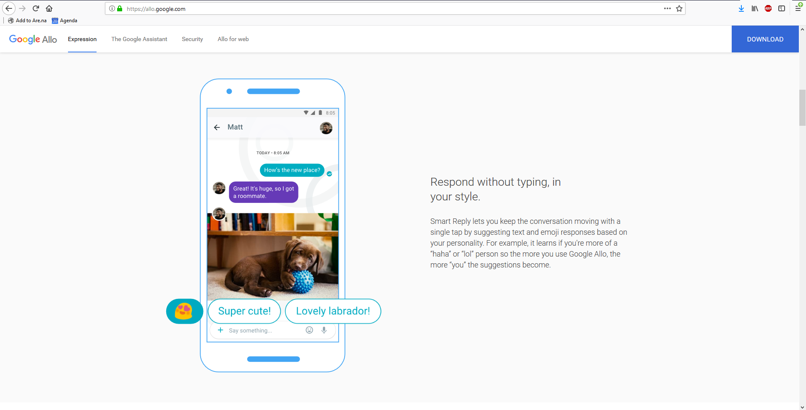
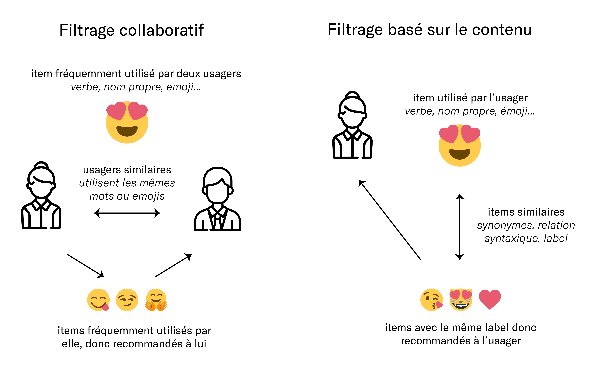
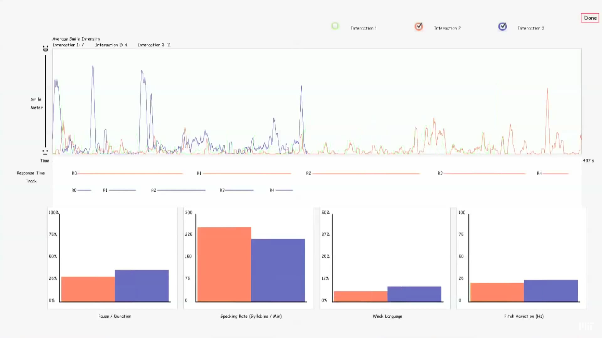
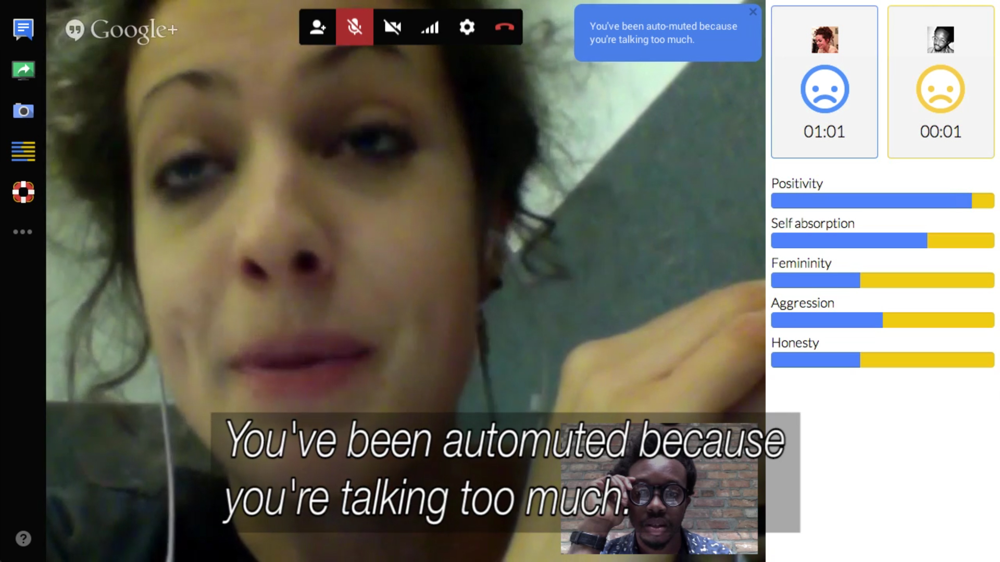
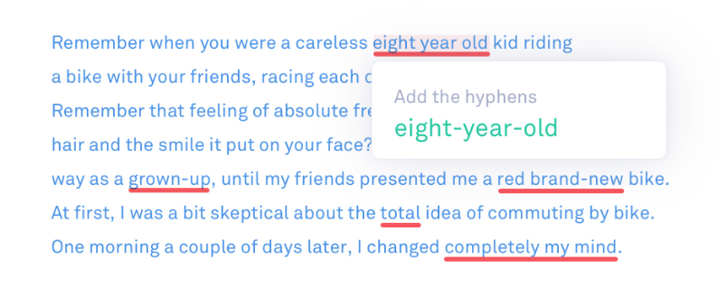
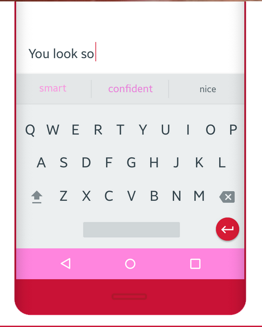

% Converser à l'ère de l'autocomplétion
% Mathilde Buenerd, Tuteur: Nicolas Nova
% Janvier 2018

---
title: "Ma master thesis"
---

<link rel="stylesheet" href="style.css"></link>

[#citation-style]: #chicago-author-date-fr

\newpage

# Converser à l'ère de l'autocomplétion

_Relecture critique des caractéristiques que l'on attribue au design d'interaction (*design invisible*, *technologie calme*, *utilisabilité*), dans le cadre des systèmes d'aide à l'écriture et à la conversation, et particulièrement de l'autocomplétion_

Mathilde Buenerd

Tuteur : Nicolas Nova

Haute Ecole d'Art et de Design (HEAD), Genève
Master HES-SO, Media design

imprimé en février 2017

\newpage

## Remerciements

\newpage

#### Notes

Les mots en italique entre \[_crochets_] sont utilisés pour clarifier la référence à des mots anglais pour lesquels un équivalent français n'est pas évident.

Tous les liens hypertextes des articles cités sont dans la bibliographie.

Le texte est disponible en ligne à l'adresse \
mathilde.buenerd.fr/converser-a-l-ere-de-l-autocompletion

\newpage

## Sommaire

\newpage

## Introduction

_Regime of computation_ [@Hayles2005], _Age of the algorithm_ [@Finn2017], ou encore _"logicialisation"_ de la société [@Citton2015], autant de termes pour désigner un même phénomène : la place grandissante du logiciel \[_software_] dans la société, à une échelle importante et dans des domaines variés : travail, finance, relations sociales etc. Une ère dominée par la figure de l'algorithme comme structure ontologique de compréhension de l'univers [@Finn2017, 21].

Une incarnation du logiciel dans la vie quotidenne concerne la multiplication des assistants personnels ou de ce qu'on pourrait nommer des _machines sociales_[@Hendler2016, 10], au sens d'ordinateurs qui ont la capacité d'interagir dans un espace social traditionnellement réservé aux humains. C'est le cas des applications de messagerie (email) ou de messagerie instantanée (Messenger, Whatsapp et autres) ou encore des assistants personnels (Siri, Alexa...). Plus que de simples intermédaires, ces services impliquent de nouvelles manières d'écrire, d'échanger, et au final, de converser. Ces nouvelles manières de s'exprimer sont permises entre autres par des fonctionnalités telles que l'autocomplétion.

L'autocomplétion désigne la fonctionnalité informatique consistant à compléter les mots qu'un usager a commencé à saisir. C'est une fonctionnalité majeure sur le web et dans les applications de conversation à distance. Elle devient une caractéristique incontournable dans le design de l'expérience utilisateur, en témoignent la multiplication de widgets comme [_autocomplete_](http://jqueryui.com/) du populaire jQueryUI (collection d'outils à destination des développeurs pour faciliter la création de sites internet).
Synonyme de _complètement_, _complètement automatique_ ou encore _saisie intuitive_ ou _saisie prédicitive_, le terme d'_autocomplétion_ a été choisi ici pour sa proximité avec le terme anglais _autocomplete_, largement employé dans le monde de la programmation informatique.

Derrière son allure insignifiante, l'autocomplétion est une fonctionnalité que l'on utilise quotidiennement et qui touche un aspect intime de notre vie : les correspondances que l'on a avec nos proches via nos appareils électroniques. En même temps, c'est aussi un exemple de technologie qu'on ne remarque pas. On rit parfois d'une suggestion inappropriée, on s'étonne (ou s'effraie) de la justesse d'une proposition qu'on avait sur le bout de la langue. Mais notre compréhension du système est généralement limitée, c'est une fonctionnalité un peu discrète (ou totalement invisible) et un peu futile (ou peu magique).

On peut être tenté de penser que l'autocomplétion est avant tout un problème technique, un problème d'ingéniérie : comment prédire les mots que l'utilisateur va écrire ? L'enjeu serait avant tout d'améliorer la précision des prédictions, et c'est probablement pourquoi toutes les interfaces (Whatsapp, Messenger, Allo...) se ressemblent fortement : l'esthétique des interfaces est interchangeable; et l'expérience utilisateur est standardisée. On pourrait également penser que l'enjeu, c'est la compréhension du langage naturel par les machines. En 1950, en définissant un ordinateur intelligent comme un ordinateur capable d'_imiter_ le langage humain de manière suffisement convaincante, le test de Turing donne à la compréhension du langage une place prépondérante dans le champ d'étude que l'on appelera bientôt _intelligence artificielle_ [@Turing1950]. Quelques années plus tard, Joseph Weizenbaum impressione le monde scientifique avec ELIZA, un programme informatique qui simule un psychothérapeute avec lequel un interlocuteur humain peut converser via un clavier [@Weizenbaum1981, 121-133].\
À l'origine, les chercheurs supposaient que cette compréhension du langage serait possible à condition de pouvoir définir précisement le langage avec des règles. Mais la complexité de décrire l'intégralité des éléments qui consituent la langue a rapidement suscité de nombreuses désillusions [@Weizenbaum1981, 5-11], et aujourd'hui encore, nous ne discutons toujours pas quotidiennement avec des robots. Si ce champ de recherche est passionant, il ne doit pas éclipser d'autres enjeux qui sont aujourd'hui négligés, en particulier des enjeux de design d'expérience et d'interface.

#### L'autocomplétion change notre manière d'échanger

Que ce soit de manière fortuite ou délibérée, les outils modèlent notre manière de parler. Un aspect de la tranformation du langage par les algorithmes est ce que Tarleton Gillespie appelle la "négociation tacite" \[_tacit negociation_] [@Gillespieed.2014, 184], c'est-à-dire qu'on adapte - délibérément ou non - son comportement pour tirer parti de l'algorithme. On ajuste son phrasé pour se rendre plus intelligible par Siri, on choisit conscieusement des hashtags pour que son contenu soit affiché dans le fil d'actualité, on rédige son site web avec des termes "search engine-friendly".[^57b4]\
Parce que l'autocomplétion a un impact sur notre manière de parler et d'échanger, et que celle-ci est un élément clé pour forger une vision du monde, le design de tels systèmes doit être consciencieusement réfléchi.

### Présentation du mémoire

Le design de tels systèmes, c'est-à-dire les décisions relatives à leur aspect et à l'interaction avec l'usager, se place dans le champ du design d'expérience et d'interface \[_user experience_, _user interface_]. Mais est-ce que les concepts sur lesquels s'appuit le design de l'expérience utilisateur sont adaptés au design des systèmes d'autocomplétion ?
Le présupposé est que non, c'est pourquoi, pour analyser les enjeux de l'autocomplétion, ce mémoire vise à faire une relecture critique de trois notions relatives au design d'interaction : le design invisible \[_invisible design_], la technologie calme \[_calm technology_] et la notion d'utilisabilité.

En premier lieu, il s'agira d'expliquer pourquoi l'évolution du fonctionnement technique des systèmes d'autocomplétion, notamment grâce aux algorithmes de _machine learning_, nécessitent de repenser la manière dont on les conçoit (partie 1).
Ensuite, trois idées seront développées : celles d'un design visible, perturbant et qui pousse à l'inventivité (parties 2 à 4). Au centre de ces thématiques se trouvent deux grandes questions : comment le design d'interface peut rendre intelligible comment un système fonctionne ? Comment penser des formes de technologies qui ne sont pas juste auxiliaires, mais provocatrices, excitantes ?
La dernière partie sera dédiée à un questionnement plus large sur la collaboration humain-machine, et à la définition de la notion de _technologie chili_ comme alternative aux tendances évoquées dans les chapitres précédents (partie 5).
Enfin, une annexe présentera des exemples d'application des principes évoqués au cours du mémoire, dans le cadre d'une application de messagerie fictionnelle.

Ce mémoire n'est pas une contestation unilatérale des principes ou des mouvements évoqués, mais plutôt une invitation à sortir de la rhétorique de "l'invisibilité" ou de "l'intuitivité" qu'on attribue au design d'interaction. Ce changement de perspective est là pour réimaginer les interactions humain-machine dans une optique où l'humour, la provocation et l'excitation sont au centre des préoccupations.

\newpage

## Du système d'autocomplétion au système de recommandation

### D'une aide à la saisie vers une aide à l'écriture

Dans le champ de la téléphonie mobile, l'autocomplétion est présente depuis plusieurs années en tant qu'aide à la saisie. A la fin des années 90, la majorité des terminaux mobiles possèdent un clavier à 12 chiffres, proche de celui des cadrans téléphoniques. Il est conçu avant tout pour la saisie de numéros de téléphone et pas pour celle de textos. Pour pouvoir y saisir du texte, chaque touche possède plusieurs lettres associées (par exemple le '2' sert aussi à saisir les lettres 'a', 'b' et 'c'), ce qui implique un problème de désambiguïsation \[_disambiguation_] lors de la saisie : comment savoir si l'usager a voulu taper un 'a', un 'b' ou un 'c' ? Les développeurs ont recours à des méthodes d'entrée pragmatiques, comme le _mutli-press_ (presser une fois pour 'a', deux fois pour 'b', trois fois pour 'c') ou le _two-keys_ (presser 'abc' puis '1' pour 'a', 'abc' puis '2' pour 'b', etc.)[^6a14]. De manière plus originale, des systèmes comme le T9[^3e08] adoptent une approche linguistique basée sur un dictionnaire comportant tous les mots de la langue [@Grover1998]. Bien que plusieurs lettres soient associées à une même touche, une séquence de touches ne pourra produire qu'un petit nombre de mots[^1715]. En combinant cela au fait que les mots ont des fréquences différentes ('tu' est beaucoup plus fréquent que 'accordéon'), on obtient un système capable de _prédire_ quel mot a le plus de chance d'être écrit. C'est d'ailleurs le terme de "texte prédictif" \[_predictive text_] qui est adopté pour désigner cette technologie de complétion.

Bien que visant à résoudre le problème d'ambiguïté de la saisie, le T9 introduit une méthode de saisie qui comporte des similarités avec les systèmes d'autocomplétion actuels, c'est-à-dire parier sur un mot en se basant sur des données (un dictionnaire) et des probabilités (les fréquences).

### L'autocomplétion aujourd'hui

Aujourd'hui, on peut distinguer deux types d'autocomplétion. La première est celle qui vient compléter les mots que l'on a commencé à saisir. C'est la descendante directe de systèmes comme le T9 et des correcteurs orthographiques. Elle est plutôt une aide à la saisie, corrige les fautes d'orthographe amugmente la vitesse d'écriture, notamment dans le cas des mots longs.\
La seconde est celle qui vient suggérer des mots ou des phrases complètes, en se basant sur le début de notre phrase ou de celle de notre interlocuteur. Elle est plus proche d'une aide à l'écriture, dans la mesure où elle est plus envahissante (pas besoin d'écrire les premières lettres). Ce type d'autocomplétion tente de prédire ce que l'on veut dire en se basant sur les mots déjà écrits, et sur les fréquences d'association des mots entre eux (par exemple une phrase qui commence par "Merci" a plus de chances d'être suivie de "beaucoup" que de "accordéon"). Ces fréquences sont calculées grâce à une approche statistique de la langue qui consiste à analyser des ensembles de milliers de textes appelés _corpus_.

Recourir à des statistiques et des probabilités pour prédire ou anticiper les actions de quelqu'un, c'est l'idée au centre d'un champ d'étude de l'intelligence artificielle particulièrement en vogue, le _machine learning_[^152f], qu'on peut traduire en français par _apprentissage automatique_. Ces algorithmes font fonctionner les assistants personnels comme Siri et produisent les recommandations personnalisées de Spotify ou d'Amazon. Ces programmes cherchent à prédire un comportement futur en se basant sur une analyse statistique des comportements passés. Ils apprenent du comportement de l'usager, et évoluent en fonction de ses habitudes. Le corollaire d'une telle technique consiste en une personnalisation grandissante de l'expérience utilisateur : le programme "s'adapte" à chaque individu.

La place centrale qu'a pris la prédiction dans les systèmes d'autocomplétion fait qu'on peut les définir comme des _systèmes de recommandation pour l'écriture_. C'est-à-dire, des systèmes qui cherchent à prédire la préférence d'une personne pour un mot, une phrase, un emoji ou une idée.

##### "Répondre sans taper, dans son propre style"

Un exemple-type de système de recommandation pour l'écriture, est l'application de messagerie instantanée développée par Google, Google Allo. Cette application de messagerie "intelligente" suggère des réponses-type en fonction des habitudes d'écriture. Elle retient par exemple si vous êtes une personne plutôt "dac" ou "ok", et intègre des suggestions à l'intérieur même des conversations grâce à un assistant semblable à Siri. Google Allo n'est pas la seule application à aller jusqu'à suggérer des mots ou des réponses préétablies. La messagerie en ligne Gmail et Facebook les utilisent aussi.

Dans le cas de ces deux dernières applications, les suggestions sont basées sur une analyse statistique des réponses écrites non pas par l'usager lui-même mais par les usagers en général. S'il est difficile de savoir exactement comment ces réponses sont produites, il est probable qu'elles ne résultent pas d'un algorithme autonome, car elles ne sont présentes que dans le cas de situations standardisées, par exemple "Merci" ou "Bien reçu". Néanmoins, on peut voir dans ces nouvelles fonctionnalités une porte ouverte vers l'usage d'algorithmes de machine learning pour faire de la recommandation conversationnelle.

### Fonctionnement d'un système de recommandation

Comprendre les grands principes de fonctionnement d'un système de recommandation permet de mieux apprécier leurs spécificités, leurs contraintes et leurs avantages, et ainsi de pouvoir les concevoir d'un point de vue de design d'expérience. Sans entrer des détails trop pointus, on peut distinguer deux grandes catégories de système de recommandation : ceux basés sur le contenu et ceux dit "collaboratifs".[^0887] Le schéma ci-dessous donner un aperçu de leurs caratéristiques.

Dans le cadre de l'autocomplétion, on pourrait par exemple différencier un système basé sur le contenu, qui recommenderait des mots liés par une relation de sens ou de syntaxe (par exemple un synonyme connu grâce à un dictionnaire) et des mots liés par un comportement collectif (par exemple des mots souvent associés par l'ensemble des usagers).

### Design d'un système d'un système de recommandation

Si l'on commence à désigner les systèmes d'autocomplétion comme des systèmes de recommandation pour l'écriture, alors on peut se poser la question de comment les problèmes qui se posent actuellement aux systèmes de recommandation peuvent les impacter. Sans en faire une liste exhaustive, on peut citer trois grandes questions : celle de la régularisation de la langue, du déterminisme qu'implique un système qui s'autoalimente et la gestion délicate des données personnelles.

##### Régularisation de la langue

On adapte son langage quand on utilise des systèmes électroniques. Mais les apps de messagerie modèlent notre manière de parler en retour. Se basant sur une approche statistique de la langue, l'autocomplétion peut réduire sa richesse en poussant les usagers à employer les mots qui sont statistiquement les plus fréquents. Sans être en mesure de prouver une transformation générale de la langue par l'autocomplétion, on peut émettre l'hypothèse d'une tendance générale vers une expression linguistique plus régulière et moins idiomatique. Une expression qui défavoriserait des aspects comme les fautes d'orthographe, le registre de langue familier, ou les mots régionaux. C'est que Kaplan appelle le "capitalisme linguistique" [@Kaplan2014] : Google a un intérêt financier à ce que les requêtes des utilisateurs soient les plus compréhensible possible. Sous cet angle, l'objectif et l'effet des outils de correction et d'autocomplétion est d'homogénéiser la langue.[^02ed] \
Dans ce cas, la diversification de la langue par l'autocomplétion peut être vue comme un contrepied. Par exemple en ne sanctionnant pas systématiquement les fautes d'orthographe, ou en proposant de manière délibérée des mots rares.

##### Déterminisme

> But when algorithms cross the threshold from prediction to determination, from modeling to building cultural structures, we find ourselves revising reality to accommodate their discrepancies. [@Finn2017, 50]

Plus on se fie à des recommandations, plus elles nous façonnent. Il y a toujours le risque que les algorithmes quittent le monde de la prédiction pour entrer dans celui de la détermination, en créant un système qui s'autoalimente. Le militant internet Eli Pariser alerte contre le risque que les recommandations créent ce qu'il appelle une "bulle de filtre" \[_filter bubble_] [@Pariser2011]. Selon lui, le personnalisation du web, c'est-à-dire l'emploi de l'historique de recherche et des données personnelles des usagers pour leur faire des suggestions, reviendrait à confiner chacun dans sa propre bulle culturelle et idéologique.\
On peut voir dans l'autocomplétion une opportunité pour justement élargir cette bulle culturelle. Si l'on imagine par exemple suggérer des mots désuets à des jeunes, ou bien des mots issus de l'argot des jeunes à des personnes âgées.

##### Gestion des données personnelles

Le revers de la personnalisation, c'est la collecte massive de données personnelles. Ces données sont récupérées, stockées, analysées. La question de la protection de la vie privée est donc centrale. Il faut garder du recul sur la personnalité des usagers perçue au travers de leurs données et garder à l'esprit qu'on ne peut pas rationnaliser la personnalité d'une personne aux données collectées sur elle. Donner aux gens accès aux données collectées sur eux, et la capacité de les modifier est donc essentiel.

#### Vers de nouvelles manières de designer

Et si l'évolution technologique était telle qu'elle nécessite de penser différemment la manière dont on conçoit l'expérience des systèmes basés sur des algorithmes de machine learning ? Si les enjeux centraux n'était pas tant l'intuitivité ou la facilité d'usage, mais la capacité à permettre la découverte ou à dépasser ses limites ?[^258b]

Alors que les possibilités offertes par ces nouveaux algorithmes sont collossales, on constate que toutes les applications de messagerie se ressemblent : elle semblent être des variations d'une même application. Designer pour l'intelligence artificielle pose un défi inédit, mais les pensées traditionnelles du design peinent à s'y attaquer.

Les causes de ce problème sont inévitablement multiples : complexité des systèmes, problèmes liés à l'interdisciplinarité. Néanmoins, plusieurs hypothèses issues de l'histoire du design peuvent se réveler problématiques : le bon design est celui qui ne se verrait pas (_design invisible_), la technologie ne devrait pas empiéter sur la vie "réelle" (_technologie calme_), le travail de designer se résumerait principalement à la résolution d'un problème.

Les trois prochains chapitres sont une relecture de ces trois caractéristiques.

\newpage

## ~~utilisabilité~~ => inventivité

L'_utilisabilité_ peut se définir par la capacité d'un objet à être utilisé de manière efficace (atteindre le but prévu), efficiente (atteindre ce but avec un effort minimal) et générer une satisfaction de l'utilisateur (être agréable à utiliser)[^0f35].

C'est un concept central dans l'histoire du design : le but du design est de résoudre un problème et la qualité d'un design se mesurerait à la l'efficacité avec laquelle l'objet atteint ce but.

Nous verrons d'abord pourquoi cette quête de l'efficacité n'est pas toujours pertinente dans le champ de la communication interpersonnelle, puis pourquoi il faut se méfier de vouloir exploiter naïvement la technologie comme une réponse à des problèmes complexes.

\newpage

### ~~Des expériences pleines de bonnes intentions ("Means well")~~ / Des expériences critiques

#### _La prison des espérances homogènes_[^12b9]

On voit apparaître dans la multiplicité des objets connectés, de nombreux produits qui se targuent de vouloir régler des problèmes profonds. Simples gadgets ou objets techniques complexes, leur point commun est que leurs auteurs sont pleins de bonnes intentions, ils viennent avec une sincère volonté de résoudre un problème. Mais être bien intentionné n'est pas suffisant pour régler des problèmes complexes, et ces projets finissent souvent par être maladroits, embarassants, voir dangereux.[^5496]
Pour illustrer cela, on peut comparer deux projets qui s'inscrivent dans le même champ d'action : l'assistance à la conversation.

Le premier projet vient du laboratoire d'_effective computing_ (littérelement _information efficace_) du MIT Media Lab, _MACH, My Automated Conversation coacH_ [@zotero-28], "mon coach automatisé pour la conversation". C'est un système qui a pour but d'améliorer sa posture et sa manière de parler lors des conversations en face-à-face. L'expérience consiste à converser avec un personnage 3D qui répond et réagit en temps réel. Il peut en outre prendre des initiatives comme interrompre une personne qui serait trop bavarde. Après la discussion, le logiciel fournit un bilan détaillé de l'interaction, en s'appuyant sur des graphiques qui retracent dans le temps un bilan des éléments non-verbaux : la fréquence des sourires, des hochements de tête, des modulations de la voix; et verbaux : la quantité de "mots faibles" (très, bien, en fait...), le débit de parole.

Le logiciel fournit les objectifs à atteindre pour améliorer sa performance et des graphiques pour comparer les différentes sessions d'entraînement pour voir ses progrès. Le projet est présenté comme un véritable assistant, notamment avec [des vidéos avant/après](https://www.youtube.com/watch?v=CHVNOiCT8vA) qui illustrent les réussites du dispositif.

Le second projet, [_us+_](http://lauren-mccarthy.com/us), par les artistes Lauren McCarthy et Kyle McDonald, est une application de vidéoconférence Google Hangouts. Son objectif affiché est d'_optimiser_ la conversation en analysant les expressions faciales et le contenu linguistique grâce à des algorithmes pouvant extraire des tendances comportementales comme la positivité, l'agressivité ou la féminité. Cette analyse est retransmise en direct à l'utilisateur avec des graphiques en barres. En plus de cette visualisation, l'application affiche des notifications qui donnent des conseils comme "Tu parles beaucoup trop", et peut effectuer des actions concrètes comme couper le son (voir image).

Bien que s'appuyant sur des études scientifiques similaires (analyse des sentiments, comparaison des temps de parole) ces deux projets illustrent deux manières d'aborder le sujet sensible de _l'amélioration_ des compétences sociales grâce à la technologie. Le premier se revendique comme une solution presque thérapeutique pour les gens qui ont des difficultés avec les relations sociales, dans des différents contextes comme un entretien d'embauche ou un rendez-vous galant[^dd06]. Derrière ce projet se trouve une vision du comportement humain comme étant rationnel, quantifiable et contrôlable grâce à des paramètres. Comme dans un jeu de gestion, on doit atteindre son but (communiquer mieux) en ajustant différents facteurs. Sauf que les règles qui régissent le "monde réel" sont plus complexes, plus imprévisibles, et espérons-le, moins déterministes que celles d'un jeu vidéo. À l'inverse, _us+_ se présente comme un outil ironique, soulignant la dépendance que l'on a envers des logiciels hors de notre champ de compréhension, et ce même dans des aspects intimes de notre vie comme dans nos communications informelles.[^d60b] C'est un projet qui est là pour poser la question ouverte de la place et les limites que l'on souhaite donner à des logiciels qui ont un contrôle grandissant sur la gestion de notre vie quotidienne. C'est l'opposition entre une vision qui se pose la question du _comment_ et une autre qui se pose celle du _pourquoi_.

\newpage

### ~~La quête de l'efficacité~~ / quête de l'imagination

Si le design doit viser à l'efficacité, alors on peut se poser la question de la signification de "communiquer efficacement". De nombreux outils nous font miroiter un "discours optimisé" : [_Ginger_](http://www.gingersoftware.com/fr) promet à l'usager "d'écrire mieux et plus vite", [_Hemingway_](http://www.hemingwayapp.com/) aide à produire une écriture "claire et audacieuse", l'extension [_Grammarly_](https://www.grammarly.com/) s'engage à la rendre "claire, efficace et sans erreur".

Cette dernière, _Grammarly_, est une application et une extension pour navigateur qui souligne en temps réel les fautes d'orthographe, de grammaire et de style. Ces corrections stylistiques incluent par exemple la limitation des répétitions et la proposition de mots plus percutants \[_compelling_]. Comme extension, elle peut superviser tout ce que l'on écrit sur le web, des emails aux statuts sur les réseaux sociaux. Chaque mot "problématique" est souligné, et une explication sur le problème qu'il pose est accessible au survol. L'extension se revendique comme un assistant pour l'écriture, promettant de la rendre plus claire et communicative.

### Ecrire clairement ?

Le problème de l'optimisation promise par ces applications, c'est qu'elle pousse à la standardisation en ramenant toutes les formes d'écriture (email, statut) vers un mode argumentaire.

> En fait la clarté est un attribut purement rhétorique, elle n’est pas une qualité générale du langage, possible dans tous les temps et dans tous les lieux, mais seulement l’appendice idéal d’un certain discours, celui-là même qui est soumis à une intention permanente de persuasion. \[...] Bien écrire – désormais seul signe du fait littéraire – c’est naïvement changer un complément de place, c’est mettre un mot “en valeur”, en croyant obtenir par là un rythme “expressif”. Or l’expressivité est un mythe : elle n’est que la convention de l’expressivité. [@Barthes1953]

Comme l'explique Barthes, la notion même de clarté ou d'expressivité d'un discours n'est pas une propriété fondamentale du langage. C'est une propriété héritée de la rhétorique, qui occulte d'autres aspects de la communication, par exemple la spontanéité. La "bonne manière de parler" est simplement une convention, qu'il est souvent bon de connaitre, mais qui ne devrait pas être vue comme un but en soi. Ces applications ont aussi une tendance à induire une confusion entre la forme et le contenu. Elles présentent le contenu comme une matière maléable qui peut se mouler dans des formes préétablies[^82d2].

Si l'argument de la "communication efficace" n'est pas univoque, doit-on pour autant se désespérer de trouver un intérêt à la conversation assistée par ordinateur ? La réponse se trouve peut-être dans la capacité d'un logiciel à challenger les habitudes des usagers, et c'est ce nous allons voir dans le prochain chapitre.

\newpage

## ~~technologie calme~~ => technologie perturbante

La notion de "technologie calme" \[_calm technology_] est introduite en 1995 par Mark Weiser et John Seely Brown dans le texte _Designing Calm Technology_ [@Weiser1995]. Ces deux figures, occupant alors des postes à responsabilité au XEROX Parc, et notamment Weiser, considéré comme le père de l'informatique ubiquitaire, font le constat que les technologies de l'information sont de plus en plus envahissantes et accaparent trop l'attention. Contre cette tendance, ils expriment leur souhait d'une technologie calme, c'est-à-dire qui n'accapare pas explicitement l'attention de l'utilisateur, et se situe en périphérie de celui-ci.

Mais les auteurs ne proposent pas tant de limiter la place des systèmes informatiques dans la vie quotidienne, ils proposent d'atténuer leur présence en les rendant moins perceptibles. Ils ne questionne pas tant l'envahissement de la technologie, mais l'attention que recquière cet envahissement.

Nous verrons tout d'abord pourquoi l'idée d'un technologie qui serait en périphérie n'est pas adaptée à la collecte massive des données personnelles qu'impliquent les logiciels basés sur du machine learning. Puis pourquoi placer l'utilisateur dans une situation contraignante est une opportunité - et même une nécessité - pour profiter des qualités intrinsèques aux algorithmes. Enfin nous expliquerons comment une technologie un peu _étrange_ peut être à l'origine d'une expérience utilisateur plus attrayante.

\newpage

### ~~Une technologie qui fait _juste_ ce qu'on lui demande~~ / Une technologie qui nous pousse un petit peu

Dans le chapitre précédent, nous évoquions les limites de la vision de la technologie comme solutionneur de problème \[_problem solver_], et la vacuité de l'idée de "communication efficace". De son côté, Weiser défend l'idée que les objets électroniques ne devraient pas gêner des tâches pour lesquelles ils ne sont pas mandatés. Mais si au contraire on considérait qu'elle peut nous pousser un petit peu en lui laissant de l'espace pour intervenir justement là où on ne l'attend pas ?

Tout designer a déjà entendu cette maxime à un moment de son parcours : _les contraintes sont créatives_. Ne pas avoir un outil parfaitement adapté peut être agaçant, mais peut aussi pousser à l'ingéniosité et générer des usages inattendus. Les contraintes obligent à sortir de ses habitudes et à imaginer des moyens créatifs de les contourner. Des créations d'Oulipo au Conditional Design du Studio Moniker [@Maurer], de nombreux artistes et designers se sont appropriés la contrainte comme processus de création.
Converser par messagerie, c'est avant tout écrire, une activité créative qui a toutes les raisons d'être réceptive à la contrainte.\
Dans son projet [_100x1000_](http://www.100x1000.net/), l'artiste Sterling Crispin propose d'écrire un court texte de cent mots avec uniquement les mille mots les plus courants de la langue anglaise. Si la personne saisis un mot qui n'appartient pas à ce corpus, il est effacé aussitôt. Son programme donne un protocole d'écriture qu'il serait épineux de suivre avec des moyens traditionnels comme une liste imprimée de mots à vérifier. _100x1000_ autorise une forme d'écriture qui ne serait pas envisageable sans l'outil informatique : il en tire pleinement parti.

[_The Most Dangerous Writing App_](http://www.themostdangerouswritingapp.com/) est une application web qui a pour but d'aider à maintenir un rythme d'écriture soutenu. L'usager paramètre un temps d'écriture (par exemple cinq minutes), durant lesquelles il doit écrire en permanance. S'il arrête de saisir du texte pendant plus de cinq secondes, tout le texte déjà tapé s'efface et est définitivement perdu. Par un protocole un peu radical et presque un peu sadique, l'application établit une situation d'écriture inédite. C'est définitivement un outil de productivité, proposant une expérience d'écriture gamifiée. Il permet de trouver des manières d'écrire qui ne seraient permises par un logiciel de traitement de texte standard. Il souligne qu'en voulant résumer le design à la résolution littérale d'un problème existant, on perd de vue les possibilités créatives offertes par les objets électroniques.

\newpage

### ~~Ne pas en dire trop sur comment le système fonctionne~~ => Dire clairement comment le système fonctionne

Dans un système de recommandation, le comportement du programme est déterminé par la récupération et l'analyse des données personnelles. Ces données "personnelles" peuvent être les informations que l'on saisis soi-même sur ses profils de réseaux sociaux, comme l'âge, le lieu de vie ou la profession. Elles peuvent également être des indications sur le comportement d'utilisation, par exemple les personnes avec lesquelles on parle souvent, ou encore les heures de fréquentation d'une application. Ces données comportementales, nous avons tendance à oublier que nous les cédons gracieusement contre la gratuité de services comme Google ou Facebook.[^9b65] Or, elles trahissent des aspects intimes de notre vie. On ne sait pas avec exactitude comment les algorithmes de ces services fonctionnent, il est donc difficile d'estimer quelles informations sont sensibles. Mais de telles quantités de données peuvent traduire plus qu'on ne pourrait l'imaginer. L'écrivaine Joanne McNeil évoque par exemple comment les "souhaits d'anniversaire" \[_birthday wishes_] sur Facebook pourraient être des indicateurs de la proximité affective que l'on a avec un "ami" [@McNeil2014]. Ces conclusions sont difficilement vérifiables, et pourtant elles sont loin d'être improbables, dans la mesure où cette proximité est une information qui peut rapporter de l'argent. Je suis plus attentive à une annonce pour des cadeaux à l'approche de l'anniversaire de mon meilleur ami, comme je le serais plus à l'approche des fêtes de fin d'année. Et pour une entreprise qui gagne de l'argent grâce à la vente d'espace publicitaire, c'est une information qui vaut de l'argent.

Dès lors, on peut interpréter de la même manière les fonctions de réponse automatique (que l'on peut considérer comme une forme d'autocomplétion) inclues dans Gmail. Dans la situation (réelle) présentée ici, quelle différence de sens y a-t-il entre "I don't have it." et "I don't, sorry.", si ce n'est que la première est plus sèche, et la seconde plus aimable ? Si je choisis la première, mon interlocuteur sera-t-il interprété comme un collègue que je n'apprécie pas trop ? Et si je choisis la deuxième, sera-t-il considéré comme une personne avec laquelle j'ai des relations amicales ?

On pourrait aller encore plus loin et spéculer sur ce qui pourrait être connu de nous dans le cas de l'analyse de conversations privées sur une application comme Messenger. La fréquence des contacts, l'usage de mots particuliers ou de smileys sont autant de facteurs qui révèlent avec précision la nature de la relation entre deux personnes (familiale, amicale, amoureuse...).

Un entreprise comme Google ne communique pas avec précision sur _comment_ elle les utilise nos données, et pourtant c'est grâce à elles qu'elle gagne de l'argent. De ce point de vue, être en mesure de pouvoir les consulter, connaître leurs implications, les modifier et les supprimer de manière simple répond à une question d'éthique.

#### Donner le contrôle sur les données personnelles

> Autrement dit, il importe, pour les designers, de travailler l'ensemble de la "chaîne de transformations" des données afin de ne pas dissocier l'organisation des informations brutes (qui est déjà une forme ou un schéma logique) de la façon dont ces connaissances seront rendues consultables à l'écran. [@Masure2016]

Ainsi, il faut donner de la visibilité à toute cette _chaîne de transformation_ des données, c'est-à-dire leur parcours depuis leur choix, leur interprétation, leur emploi dans l'expérience et leur consultation pour l'usager final. C'est une nécessité pour ne pas placer le design comme un acte de polissage, comme un décor qui viendrait s'imposer sur un système technique complexe. Le téléphone mobile est d'une part un objet dont le fonctionnement technique est un mystère pour des milliers d'usagers, et son interface est d'autre part une couche d'abstraction encore supplémentaire. Si cette opacité n'est assurément pas involontaire, et peut s'expliquer entre autres par des considérations commerciales, elle pourrait s'estomper grâce à un design qui présente de la donnée personnelle une entité visible, accessible et modifiable.

\newpage

### ~~une technologie qui agit en arrière-plan~~ / une technologie explicitement paramétrable

Une notion au centre de la _calm technology_ est celle de "périphérie". Weiser recommande de concevoir des objets électroniques qui sont présents de manière ambiante[^3b2a], et qui s'approprient le moins possible l'attention explicite de l'utilisateur. Une illustration de cette idée est celle du thermostat, qui une fois configuré ne nécessite plus d'intervention pour maintenir la température souhaitée. Concrètement, un moyen souvent évoqué est de recourir à des capteurs, qui vont recueillir des informations "en arrière plan", et ainsi laisser à l'usager toute son attention.

#### _Fais ce que je dis, pas ce que je fais_

La personnalisation, dans le sens de l'adaptation d'un système aux habitudes de l'utilisateur, élément clé des systèmes de recommandation, repose précisement sur cette idée. Ces derniers se nourrissent de notre comportement quotidien implicite, comme retenir les mots employés fréquement pour nous les proposer par la suite, ou encore identifier les contacts desquels nous sommes le plus proches pour nous suggérer qui est en ligne. Toujours en quête de métadonnées à analyser, ils considèrent des actions inconscientes comme des choix manifestes.

> In other words, how are we to deal with a common problem faced by parents who often say to their children, _Don’t do what I do; do what I say_ ? Obviously while learning by observation is a good way to learn about things in the world and actions to take in certain contexts, it is not enough to actually know why you are taking an action, or when you should take an action. [@Hendler2016, 158]

Cependant, comme le souligne Hendler dans son ouvrage sur ce qu'il appelle les "machines sociales", que ce soit par manque d'expérience ou par erreur de jugement, on est tous amené à faire des actions que l'on n'approuve pas tout à fait ou que l'on ne considère pas comme nous représentant réellement. Entre ce que je suis, ce que je fais, et ce que je voudrais être, il y a des écarts qui peuvent être lourds de signification. Or la personnalisation ne prend pas en compte ces contradictions qui font partie du comportement humain. Le système voit ainsi ses usagers sous une identité simplifiée, caricaturale, pour des raisons qui peuvent être au mieux techniques, au pire tout à fait idéologiques[^a8fe]. C'est là un enjeu de la personnalisation : comment faire le tri entre les actions qui sont signifiantes et celles qui ne le sont pas, et qui peuvent même être contradictoires avec la personnalité réelle d'un individu. \

C'est pourquoi un point primordial à considérer est celui de concéder à l'usager le contrôle sur son identité. Cela impose de ne plus avoir une personnalisation autosuffisante, mais guidée par l'usager lui-même. Il s'agit donc de promouvoir des systèmes hybrides, qui combinent les données collectées avec les injonctions explicites de l'utilisateur final. Une adaptation qui n'est pas "en arrière plan", mais dans le fait de donner à chacun la possibilité de maîtriser l'image de lui sur systèmes qu'il utilise.

\newpage

<!-- #### Principe : Une technologie qui nous pousse un petit peu
-> Image : Mots interdits / Par exemple interdiction d'utiliser des mots trops courants -->
<!--
### ~~technologie familière~~ / technologie étrange

\newpage -->

## ~~design invisible~~ => design visible

#### "La meilleure interface est... pas d'interface"

Nous venons de voir les problèmes que peut soulever l'idée de calm technology, notamment dans le cadre de systèmes manipulant des données personnelles. Souvent affiliée sur le plan idéologique avec l'idée de "calm technology", la notion de "design invisible" ou le mouvement _NoUI_ (littéralement _pas d'interface utilisateur_), nouvellement popularisés par des designers comme Golden Krishna dans son livre _The Best Interface is No Interface_ [@Krishna2015], sont plusieurs termes qui désignent une même tendance : celle selon laquelle le bon design est celui qui ne se voit pas, celui qui génère le moins de friction possible avec l'utilisateur[^5f04]. Ce mouvement considère l'interface graphique \[_GUI, Graphical User Interface_] comme une couche additionnelle à l'expérience utilisateur, et qui n'a pas de raison d'être en dehors de celle-ci.

Or, la multiplication des assistants personnels et la prolifération d'outils de _quantified self_ oriente de manière significative nos prises de décisions. Ces outils ne nous disent pas quoi faire, pas plus qu'ils ne décident à notre place, mais l'on se repose de plus en plus sur eux pour ordonner notre vie de tous jours. Pour cette raison, la compréhension du système par les usagers est primordiale et une interface visible est une étape clé dans l'élaboration de cette "médiation technique".

Ce mouvement est régulièrement critiqué. On peut par exemple citer Timo Arnall[^1cb3] ou Dave Hall[^f0f4] pour les articles critiques qu'ils ont publiés à ce sujet. Ici, nous allons voir pourquoi ces idées sont particulièrement problématiques dans l'ère du machine learning, en prenant l'angle de deux principes liés au mouvement NoUI : tirer partie des ordinateurs plutôt que les servir et ne pas montrer comment le système fonctionne.

\newpage

### ~~Tirer parti des ordinateurs plutôt que de les servir~~ => S'adapter à la logique computationnelle

Parmi les principes évoqués dans _The Best Interface is No Interface_, il y a celui selon lequel ce n'est pas aux humains de s'adapter aux ordinateurs, mais aux ordinateurs de s'adapter aux humains. Et si, à l'inverse, encourager les usagers à s'adapter à leurs outils, c'était leur donner la capacité de mieux les comprendre et de construire les conditions nécessaires à une appropriation plus forte de la technologie par les gens qui la côtoient au quotidien ?

Pour illustrer son propos, Krishna prend l'exemple du remplissage de formulaires en ligne. Il évoque ce moment agaçant, quand on ajoute des tirets, des espaces ou des points entre les nombres de notre numéro de téléphone, et que le système nous indique par un message d'erreur qu'il ne doit contenir que des chiffres. Selon lui, il faut créer des systèmes qui savent reconnaître et interpréter ces "erreurs", de manière à ne pas ennuyer l'utilisateur avec des détails techniques, qui n'ont de sens que pour la machine.

+ (faire un schéma) Dans la première situation, je rentre _0635527684_, et je sais que l'ordinateur a récupéré _0635527684_. Dans le second, je pourrais rentrer _06.35.52.76.84_ et l'ordinateur récupèrerait _0635527684_.

Néanmoins, contraindre l'usager à parler à l'ordinateur dans son langage, lui demander de s'adapter à son mode de compréhension, génère une connaissance plus juste de la réalité des capacités techniques des ordinateurs. Quand je rentre mon numéro de téléphone, mon ordinateur ne sait pas comment m'appeler, il ne fait qu'associer une suite de nombres à mon profil, sous le label "téléphone". M'obliger à ne pas inclure d'espace quand je saisis mon numéro, c'est me rappeler que ce n'est pas mon numéro de téléphone que l'ordinateur comprend, mais bien une série de chiffres.

La nuance est mince, mais contribue à alimenter une incompréhension de la technologie par les gens qui l'utilisent pourtant au quotidien. Or, une technologie incomprise génère de la frustration et restreint la créativité. Une étude conduite par Erika Shehan Poole et al montre que les problèmes posés par une mauvaise compréhension de la technologie incluent : de mauvaises suppositions sur les risques d'adoption de cette technologie; des attentes en terme de bénéfices qui sont en décalage avec la réalité des possibilités techniques; des difficultés à trouver des solutions quand intervient un problème avec celle-ci [@Poole2008]. Il cite l'exemple d'une personne qui pensait que les RFID étaient des traqueurs de position. Cette croyance populaire (que les auteurs nomment en anglais _folk theories_) le faisait s'inquiéter que des vendeurs ou des organisations gouvernementales utilisent des technologies basées sur le RFID pour l'espionner. Cette situation illustre comment un malentendu sur son fonctionnement peut avoir des conséquences considérables sur l'adoption d'une technologie. De plus, l'étude conclue que, même s'ils portent en eux de sérieuses inquiétudes face aux nouvelles technologies, les participants étaient réticents à faire remonter publiquement leurs doutes. Une des raisons avancées est qu'ils doutent de leur possibilité d'avoir leur mot à dire dans une évolution technologique qu'ils perçoivent comme inévitable.

> By removing our knowledge of the glue that holds the systems that make up the infrastructure together, it becomes much more difficult, if not impossible, to begin to understand how we are constructed as subjects, what types of systems are brought into place (legal, technical, social, etc.) and where the possibilities for transformation exist [@Ratto2007].

Sur le même sujet, Matt Ratto souligne qu'une incompréhension de la technologie rend difficile, voir impossible une réflexion sur les possibilités de transformation de celle-ci. En ne montrant pas le fonctionnement d'un système, on retire aux gens leur abilité à le comprendre, le critiquer et le reconfigurer, c'est-à-dire leur abilité à imaginer que les choses soient différentes. Vu sous cet angle, le design "invisible" participe à creuser un fossé entre les professionnels qui créent des ces objets électroniques et les personnes qui les utilisent. On voit que les conclusions que l'étude témoignent d'un imaginaire technologique limité chez les usagers (mauvaise estimation des possibilités techniques, difficulté d'improviser en cas de problème). Dans ce contexte, donner les clés de compréhension d'un système en demandant une adaptation des usagers à la logique computationnelle rendrait possible un renouvellement de cet imaginaire. Les objets électroniques et les logiciels ne devraient pas être vus uniquement comme complexes (même s'ils le sont indéniablement), ni comme une matière figée, mais au contraire comme des entités en permanente évolution, questionnables, et qui peuvent être modelées de manière collaborative [@Finn2017, 7].

\newpage

### ~~La magie de l'invisibilité~~ => La nécessité de visibilité

Les modèles statistiques à la base des algorithmes de machine learning parviennent, par l'analyse de grandes quantités de données, à souligner des corrélations invisibles pour un humain ordinaire. Ces liens mystérieux sont fascinants, ils captivent, bien qu'ils ne soient pas une source de connaissance explicable. A titre d'exemple, on peut penser aux "pics de rupture" appuyés sur les mises à jour de statut Facebook, qui montrent une hausse au début du printemps et deux semaines avant Noël[^5ee2]. Quelle explication donner à ce phénomène ? Difficile à dire. Si l'on peut s'amuser à faire des suppositions, il faut garder à l'esprit que cela peut se réveler problématique.

#### Déceler les dysfonctionnements

Pour illustrer cette problématique, on peut se pencher sur une étude exposant le problème posé par une faible intelligibilité des modèles basés sur du machine learning. "L'intelligibilité" correspond à la capacité à comprendre pourquoi le système prend une décision. \
Cette étude se place dans le cadre de services de santé. Son but était de concevoir un modèle capable de déterminer les patients avec une haute probabilité de décès (PDD) par pneumonie de manière à les hospitaliser, et traiter ceux avec une faible probabilité en consultation externe [@Caruana2015][^a3fa]. Deux modèles sont envisagés : un basé sur des réseaux de neurones \[_neural networks_], avec une précision plus élevée mais jugé trop risqué, et un second, basé sur des règles, moins précis, et qui sera choisi en définitive.
Sans entrer dans des détails techniques[^32da], ce second modèle permet explicitement, à l'inverse du premier, de voir les relations entre entre chaque valeur analysée et la PDD associée. Il révèle par exemple que, statistiquement, être asthmatique est corrélé avec un faible niveau de PDD. À première vue, c'est une observation illogique. En fait, il s'avère que les patients atteints de pneumonie avec des antécédents asthmatiques sont généralement expédiés en unité de soins intensifs. Comme le pronostic pour ces patients est meilleur que la moyenne, leur chance de survie l'est aussi. Ainsi, la corrélation existe, mais il n'y pas de lien de causalité. Malgré sa puissance de calcul, l'analyse statistique ne différencie pas la réelle bonne performance du système médical et une supposée robustesse de la santé du patient. Si le modèle basé sur le réseau de neurones avait été choisi, il aurait pu délibérement suggérer d'envoyer un patient asthmatique en consultation externe au lieu des urgences. Cet exemple illustre la nécessité de ne pas avoir une confiance absolue dans des algorithmes dont on n'est pas en mesure de comprendre le fonctionnement.[^fc8b]

Dans un système d'autocomplétion basé sur du machine learning, une dérive pourrait par exemple se trouver si certaines associations statistiques de mots étaient révélatrices de préjugés. Par exemple, si les adjectifs associés à un pronom féminin étaient différents de ceux associés à un pronom masculin, et traduisaient une tendance à qualifier les femmes par leur physique et les hommes par leurs capacités. Ce ne serait pas un biais causé par le système d'autocomplétion, mais un biais qui existe dans le monde réel [@Bian2017] et qui serait ainsi prolongé. Grâce à une visibilité sur de telles corrélations, il est possible d'établir des rééquilibrages pour favoriser certains aspects de la langue. C'est par exemple le constat à l'origine d'une application de clavier initée par Plan International, le [sheboard](https://sheboard.com/) [@zotero-89]. Ce clavier a pour spécificité un système d'autocomplétion qui suggère des mots issus de champs lexicaux qui vont contre les préjugés que l'on porte envers les femmes.

En ayant une visibilité sur comment les suggestions sont produites, on offre la possibilité de relativiser des résultats inappropriés, et d'élaborer des stratégies pour leur faire face.

\newpage

## Vers de nouvelles formes de collaboration humain-machine

Au cours des trois chapitres précédents, nous avons vu comment les logiciels changent, et pourraient changer notre manière d'interagir via la parole et l'écriture. Nous avons également vu quelles habitudes de conceptions instaurer pour tenir compte des spécificités des expériences basées sur des algorithmes. Ces habitudes s'articulent autour de trois points clés : en premier lieu, pousser à l'inventivité en priviliégiant une approche critique et en valorisant des usages insolites sur la résolution d'un problème. En second lieu affirmer la présence . Et enfin, expliquer le fonctionnement du système grâce à l'interface.

Dans cette dernière partie, qui sert de conclusion, nous élargirons le sujet sur la relation humain-machine en questionnant l'idée d'assistant personnel et en désignant la modularité et la paramétrabilité d'un logiciel comme des caractéristiques essentielles.. Puis nous définirons l'idée de _technologie chili_ comme une synthèse des points évoqués dans les chapitres précédents

### Une technologie _chili_

> Maybe you want _chili technology_, maybe you actually think that technology is something a bit exciting that should push you a little bit. Not just being in the background and do just what you want to do, but sometimes, come in your life and have a kind of unexpected effect. [@Kaplan2007]

Si les termes contestés dans les chapitres précédents ne sont pas satisfaisants, pourquoi ne pas en essayer un autre ? Dans une conférence à Lift en 2007, Frederic Kaplan évoque l'idée d'une "chili technology", qu'il oppose à la calm technology. Il définit ce type de technologie par sa capacité à être un peu excitante, à surprendre et à provoquer de l'inattendu. Une forme de technologie qui ne viendrait pas seulement résoudre un problème, mais pimenter la vie de tous les jours.

-> pas en arrière plan / Visible
-> pas calme / excitante, surprenante
-> fait pas juste ce que tu veux qu'elle fasse / A une forme d'autonomie, est là où on ne l'attend pas

#### Un objectif : pousser à l'inventivité
L'objectif d'une application ne doit pas être vu sous l'angle utopique de rendre le monde meilleur, mais sous celui de créer un espace pour proposer des modes de pensée qui ne sont pas accessibles par un humain. Créer un espace littéral et intellectuel pour la pensée associative, la curiosité et la créativité.

#### Une expérience perturbante
Un logiciel doit montrer qu'il est là. L'usager doit avoir conscience de se servir un système automatisé, pour pouvoir en tirer parti au maximum et ne pas être frustré lorsqu'il ne fonctionne pas.

#### Une interface visible
L'interface n'est ni une couche de décoration, ni une couche superflue. C'est un élément qui doit donner les clés de compréhension d'un système.

 Pour résumer, ces stratégies s'articulent autour de trois points.
+ Un design _visible_
  + L'élimination de toute forme de friction n'est pas un but.
  + L'interface doit présenter de manière ostensible le parcours des données de l'usager.
  + La présence de décisions basées sur des algorithmes doit être explicitement énoncée.
+ Un design _subversif_
  + Un usager n'a pas une identité unique. Le système doit  en compte ces variations.
  + La présence de contrainte dans le parcours de l'usager doit être vue comme une aubaine pour proposer une expérience originale.
+ Un design qui pousse à _l'inventivité_
  + L'exploitation des caractéristiques des algorithmes est autant valable que la résolution d'un problème.
  + Une approche critique de la technologie doit primer sur une approche naïve.

### La technologie en tant qu'outil créatif d'expression et non en temps qu'assistant

Ces principes doivent nous amener à regarder les objets électroniques sous un regard qui n'est pas celui de l'assistant personnel. Est-on obligé de penser l'assistance sous l'angle d'une visée utilitariste ? N'y aurait-il pas des alternatives ?

L'imaginaire que l'on associe aux "assistants personnel" est influencé par une vision anthropomorphique de l'intelligence artificielle. On considère qu'un ordinateur intelligent est un ordinateur qui se comporte comme un humain : qui est capable de parler, écrire, être émotif. Mais les appareils électroniques peuvent avoir un intérêt au-delà de cette image de l'humain "augmenté". On peut voir l'autocomplétion non pas comme un assistant mais comme un _outil créatif_.

La relation que l'on a avec un assistant est une relation hiérarchique, il nous est subordonné. Il est celui auquel on délègue une tâche, qu'on est souvent en mesure de réaliser, mais qu'on n'a pas envie de faire. Pourquoi ne pas penser cette relation plutôt comme une forme de collaboration ?

On peut voir dans les machines des circonstances nécessaires pour penser et s'exprimer différement et non pas un assistant qui là pour augmenter notre productivité. La clé de voûte de la relation humain-machine, notamment dans le cadre de systèmes d'aide à la parole et à l'écriture, est peut-être l'inventivité.
Pour pouvoir profiter de ces qualités qui sont au-delà même de ce qu'on peut imaginer,

Comme dans une équipe, le succès d'une collaboration réside dans la compréhension mutuelle entre les deux équipiers. Elle peut passer, comme nous l'avons vu dans la partie 2, par une interface qui laisse transparaître le fonctionnement du système. Mais elle peut aussi passer par des logiciels aisément configurables. C'est-à-dire privilégier des formes de logiciel qui soient modulaires et paramétrables, avec des possibilités d'usage exponentielles. Par _modulaire_ j'entends un logicel sur lequel on peut venir des greffer d'autre petits logiciels, de manière enrichir ses fonctionnalités. Par _paramétrable_ j'entends des possibilités de configuration étendues. Ces deux directions encouragent une diversité des fonctionnalités en laissant aux usagers eux-mêmes la possibilité de personnaliser leurs outils.

### Le modèle des extensions

Un modèle qui tire parti de cette modularité est celui des extensions \[_addons_] pour navigateurs (Firefox ou Google Chrome par exemple). Une extension est un petit programme qui enrichit les fonctionnalités d'un navigateur. Ce n'est pas un logiciel ni une application en soit, mais un module que l'on peut greffer sur un logiciel existant pour étendre ses fonctions. Certaines extensions sont officielles et grand public (bloqueurs de publicité, calendriers, traducteurs). D'autres ressemblent plus à de petits _hacks_[^e149], par exemple _I'm not robot captcha clicker_ valide le captcha à la place de l'usager pour lui faire gagner quelques secondes, ou bien _Disable Ctrl-Q_ empêche de fermer son navigateur par accident avec le raccourci clavier 'ctrl+Q'. D'autres enfin sont des projets artistiques, voir activitistes, par exemple [loveMachine](http://lovemachine.cc/), qui envoie un "j'aime" à toutes les publications disponibles dans le fil d'actualité de Facebook pour compliquer la tâche des entreprises faisant de la publicité ciblée.\
Les extensions peuvent provenir de sources variées, de développeurs professionnels comme amateurs, ce qui les rend porteuses d'une diversité impossible à trouver dans un logiciel classique.

### L'importance d'avoir des logiciels paramètrables et modulaires

> Ainsi, ce que dénonce David M. Berry, c’est bien le développement de certains types de machines (programmes) avec lesquelles nous ne pouvons strictement rien faire, ou peu faire, ou ne rien faire qui n’ait déjà été anticipé – des machines qui « rendent service » de façon si parfaitement programmée qu’aucune marge de manoeuvre ne sera possible, mettant ainsi en défaut toute conduite technique. Contre l’automatisation issue des sciences comportementales, il nous faut donc oeuvrer à rechercher et à créer des « marges d’indétermination » au sein de nos rapports aux machines." [@Masure2016]

Si l'on commence à penser une application non pas comme un logiciel parfaitement conçu, à utiliser selon des critères prédéfinis, mais comme une base pouvant être étendue à l'infini par l'usager, alors on laisse une place à des usages originaux et inventifs. On laisse aussi la place à

|    Etat actuel                         |    Etat futur                            |
|----------------------------------------|------------------------------------------|
| quelques fonctionnalités activées en permanence | beaucoup de fonctionnalités activables/désactivables |
| une interface pour tout le monde       | une interface par conversation/contextes |
| fonctionnalités permanentes            | fonctionnalités interchangeables         |
| monolithique                           | modulaire                                |
| utilisable                             | configurable                             |
| quelques grosses fonctionnalités       | ensemble de micro-fonctionnalités        |

\newpage

## Annexe : Et si... ?

Toute au long de ce mémoire, j'ai défendu plusieurs principes qu'ils me semblent utiles de garder à l'esprit quand on conçoit l'expérience et l'interface d'un système d'autocomplétion.

En parallèle, en temps que praticienne, il me paraissait important d'illustrer ces principes par des exemples d'application concrets. Cette annexe présente une petite collection d'interfaces fictionnelles, qui tirent parti des algorithmes de machine learning, en se plaçant dans la lignée de la technologie chili.

\newpage

### Gestionnaire de personnalité

\newpage

### Ecrire dans le style de...

\newpage

Imprimé à la HEAD - Genève, sur du papier ..., avec le caractères typographiques ...

Ce texte est également disponible en ligne sur le site internet mathildebuenerd.fr.

\newpage

## Bibliographie

<!-- La bibliographie est générée automatiquement avec Zotero -->

[#bibliography]: #

### Iconographie

+ Filtrage collaboratif / Filtrage basé sur le contenu
Schéma : http://i65.tinypic.com/2ebah6c.png
Emojis : Par Twitter, www.flaticon.com
Personnages : Par Freepik, www.flaticon.com

[^f0f4]: [@Hall2017].

[^a8fe]: On peut penser par exemple à Mark Zuckerberg, qui déclarait en 2011 à David Kirkpatrick dans _The Facebook Effect_ (Simon & Schuster) qu'avoir deux identités était un exemple de "manque d'intégrité".

[^dd06]: [Explication des motivations derrière le projet](https://www.youtube.com/watch?v=l3ztu9shfMg), par leurs auteurs.

[^d60b]: Pour une critique plus approfondie d'us+, voir [@zotero-30].

[^12b9]: [@2015]

[^258b]: Pour une analyse plus détaillée des liens entre design d'expérience et machine learning, voir [@Girardin2016].

[^5f04]: On peut également citer _The Invisible Computer_ de Don Norman, publié en 1998.

[^3b2a]: C'est la vision à la base de la notion d'informatique ubiquitaire, que Weiser a contribué à définir et populariser. Voir http://www.ubiq.com/hypertext/weiser/UbiHome.html

[^57b4]: L'optimisation délibérée des contenus pour les rendre plus facilement indexables par un algorithme n'est que l'aspect le plus visible de cette négociation tacite. Parmi d'autres aspects Gillepsie cite le recours à des hashtags populaires non-relatifs au contenu pour se faire remarquer, ou encore les utilisateurs que P2P qui font exprès des fautes de frappes pour "cacher" un contenu illégal.

[^6a14]: Pour un historique plus détaillé des différentes méthodes de disambiguation, voir [@Silfverberg2000].

[^1715]: On estime à à peine 5% la probabilité d'erreur de prédiction grâce à cette approche linguistique [@Silfverberg2000].

[^3e08]: _"text on 9 keys"_, basé sur les travaux de Scott Minneman et développé par Tegic Communications Inc. à la fin des années 90. On peut aussi citer l'iTap (Motorola) ou la technologie LetterWise qui ont une approche assez similaire.

[^02ed]: Voir aussi l'extension de la métaphore financière par Pip Thornton, qui parle de la possible création d'un "langage subprime" [@Thornton2017].

[^a3fa]: Pour une analyse de cette étude voir [@Manny2017].

[^0f35]: Selon la norme ISO 9241-11. Voir sur Wikipédia https://fr.wikipedia.org/wiki/Utilisabilité

[^e149]: Un hack est une solution rapide, bricolée mais ingénieuse pour contourner un problème [@zotero-52].

[^5496]: Par exemple [LegalFling](https://motherboard.vice.com/en_us/article/paqvn7/dont-fuck-anybody-who-wants-to-get-your-consent-uploaded-to-the-blockchain-legalfling-app), une app qui utilise la technologie de la blockchain pour gérer le consentement à avoir une relation sexuelle.

[^152f]: En 2017, "machine learning" et "deep learning" (une méthode spécifique d'application du machine learning) étaient tout en haut du "pic des attentes exagérées" \[_peak of inflated expectations_] du [Gartner Hype Cycle](https://blogs.gartner.com/smarterwithgartner/files/2017/08/Emerging-Technology-Hype-Cycle-for-2017_Infographic_R6A.jpg).

[^0887]: En pratique, ces systèmes sont généralement hybrides, ils mélangent ces deux approches.

[^9b65]: "Nous recueillons des informations sur les personnes et les groupes avec lesquels vous êtes en contact, ainsi que la manière dont vous interagissez avec eux (par exemple, les personnes avec qui vous communiquez le plus ou encore les groupes au sein desquels vous aimez vous exprimer)", "Nous recueillons également des informations concernant la manière dont vous utilisez nos Services, telles que \[...] la fréquence et la durée de vos activités." Voir la [_Politique d’utilisation des données_](https://www.facebook.com/privacy/explanations) de Facebook.

[^5ee2]: Voir la [datavisualisation](https://informationisbeautiful.net/2010/peak-break-up-times-on-facebook/) de David McCandless & Lee Byron.

[^fc8b]: Pour une analyse plus détaillée, et des propositions concrètes sur comment rendre visible une décision est automatisée, voir [@Sheret2017].

[^32da]: Pour une explication plus approfondie de pourquoi des réseaux de neurones sont opaques par nature [@McQuillan2017].

[^82d2]: Pour une analyse plus détaillée des systèmes de correction, voir [@Christie2017].

[^1cb3]: [@Arnall2013].
